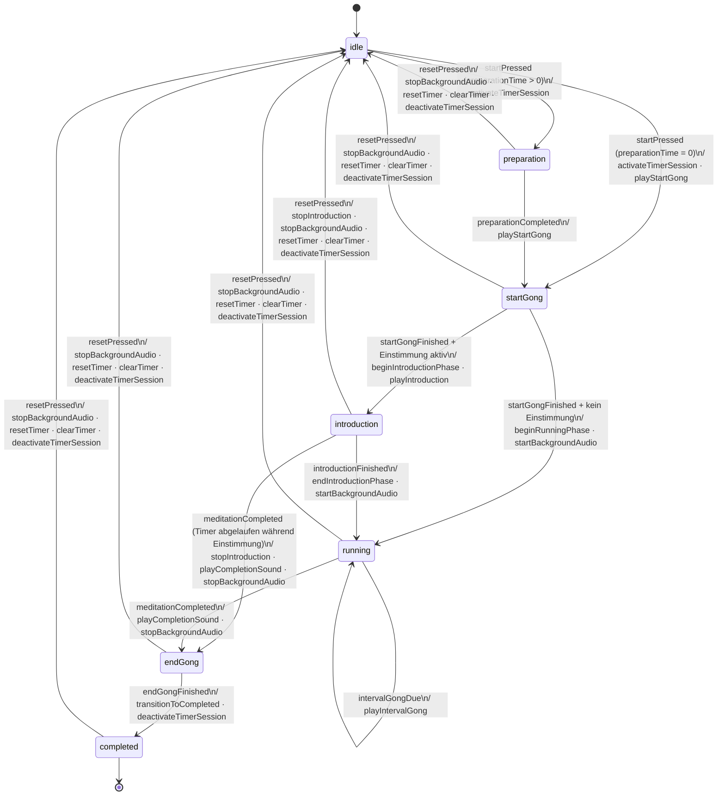

# Timer State Machine

Zustandsmaschine des `MeditationTimer`-Domain-Modells.
Implementiert in `ios/StillMoment/Domain/Models/MeditationTimer.swift` und
`android/app/src/main/kotlin/com/stillmoment/domain/models/MeditationTimer.kt`.

---

## Zustandsdiagramm

---

## Zustände

| Zustand | Bedeutung | Timer läuft? |
|---------|-----------|:---:|
| `idle` | Kein aktiver Timer (`self.timer == nil` im ViewModel) | — |
| `preparation` | Vorbereitungs-Countdown (z.B. 15 Sek) | — |
| `startGong` | Start-Gong spielt, Timer zählt bereits ab | ✓ |
| `introduction` | Einstimmungs-Audio läuft, Timer zählt ab | ✓ |
| `running` | Stille Meditation, Timer zählt ab | ✓ |
| `endGong` | End-Gong spielt (Timer steht bei 00:00) | — |
| `completed` | Gong fertig, Abschluss-UI sichtbar | — |

---

## Transitionen

| Von | Nach | Auslöser | Effekte |
|-----|------|----------|---------|
| `idle` | `preparation` | `startPressed` (preparationTime > 0) | `activateTimerSession`, `startTimer` |
| `idle` | `startGong` | `startPressed` (preparationTime = 0) | `activateTimerSession`, `startTimer`, `playStartGong` |
| `preparation` | `startGong` | `preparationCompleted` (Domain-Event) | `playStartGong` |
| `startGong` | `introduction` | `startGongFinished` + Einstimmung konfiguriert | `beginIntroductionPhase`, `playIntroduction` |
| `startGong` | `running` | `startGongFinished` + keine Einstimmung | `beginRunningPhase`, `startBackgroundAudio` |
| `introduction` | `running` | `introductionFinished` (Audio-Callback) | `endIntroductionPhase`, `startBackgroundAudio` |
| `introduction` | `endGong` | `meditationCompleted` (Timer abgelaufen) | `stopIntroduction`, `playCompletionSound`, `stopBackgroundAudio` |
| `running` | `running` | `intervalGongDue` (Domain-Event) | `playIntervalGong` |
| `running` | `endGong` | `meditationCompleted` (Domain-Event) | `playCompletionSound`, `stopBackgroundAudio` |
| `endGong` | `completed` | `endGongFinished` (Audio-Callback) | `transitionToCompleted`, `deactivateTimerSession` |
| beliebig | `idle` | `resetPressed` | `stopIntroduction`¹, `stopBackgroundAudio`, `resetTimer`, `clearTimer`, `deactivateTimerSession` |

¹ Nur wenn Zustand `introduction`.

---

## Hinweise

**`idle` = kein Timer-Objekt.** `TimerState.idle` existiert im Domain-Modell, wird aber vom ViewModel gefiltert (`handleTimerUpdate` ignoriert Idle-Timer). Im ViewModel gilt: `idle` ⟺ `self.timer == nil`.

**Timer-Countdown während `startGong` und `introduction`.** Der Countdown läuft bereits während der Gong spielt und die Einstimmung abgespielt wird. Das Display zeigt die echte verbleibende Meditationszeit — nicht die Audio-Länge.

**Intervall-Gong-Baseline.** `shouldPlayIntervalGong` berechnet Intervalle ab `silentPhaseStartRemaining` — dem Zeitpunkt an dem die stille Meditation beginnt (`beginRunningPhase` bzw. `endIntroductionPhase`). Ohne diese Baseline würde die Introduction-Zeit in den ersten Intervall einfließen.

**Keep-Alive läuft durch.** `activateTimerSession` startet ein lautloses Audio-Keepalive das bis `deactivateTimerSession` durchläuft — auch während `endGong`. Dadurch kann der End-Gong bei gesperrtem Bildschirm abspielen.

**Audio-Callbacks als Transitionen.** `startGongFinished` und `endGongFinished` kommen von `AudioService.gongCompletionPublisher`. Die State Machine wartet auf den Callback — nicht auf einen Timeout. `introductionFinished` analog via `introductionCompletionPublisher`.
