# ticket-flow: Visueller Guide

> Generischer Agent-Orchestrator fuer Claude Code.
> Basiert auf: [ticket-flow-orchestrator.md](ticket-flow-orchestrator.md)

---

## 1. Big Picture

**Problem:** Ein 500-Zeilen Bash-Script orchestriert AI-Agents. Es funktioniert, ist aber nicht portierbar, nicht testbar und vermischt alles.

**Loesung:** Ein Python-Tool (`ticket-flow`) trennt Mechanik von Konfiguration.

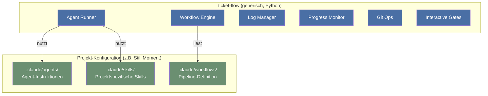

**Kernidee:** Der Workflow (Phasen, Review-Loop, Gates) ist ueberall gleich. Nur Agents, Skills und Quality-Gates sind projektspezifisch.

---

## 2. Pipeline-Ueberblick

Sechs Phasen. Zwei interaktive Gates. Ein Review/Fix-Loop.

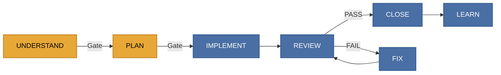

| Farbe | Bedeutung |
|-------|-----------|
| Orange | Interaktiv — wartet auf User-Input |
| Blau | Autonom — laeuft ohne Eingriff |

---

## 3. Phasen im Detail

### 3.1 UNDERSTAND + PLAN (die interaktiven Phasen)

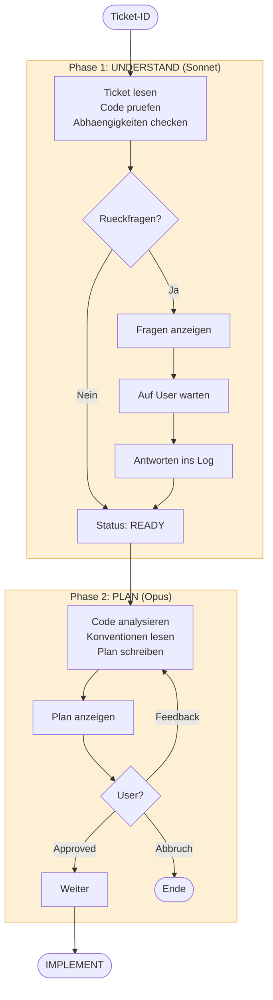

**Warum zwei Gates?**
- UNDERSTAND fragt *bevor* geplant wird: Ist das Ticket noch aktuell? Fehlen Infos?
- PLAN ist der Vertrag: 2 Minuten Review hier sparen 20 Minuten Revert spaeter.

### 3.2 IMPLEMENT (die autonome Arbeitsphase)

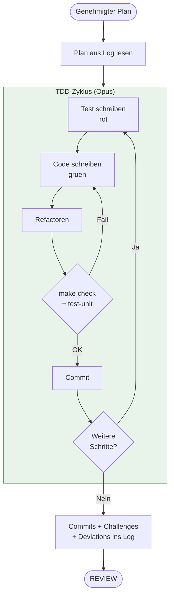

**Deviations:** Wenn der Implementer vom Plan abweichen muss, dokumentiert er das explizit. Der Reviewer bewertet spaeter ob die Abweichung gerechtfertigt war.

### 3.3 REVIEW / FIX Loop

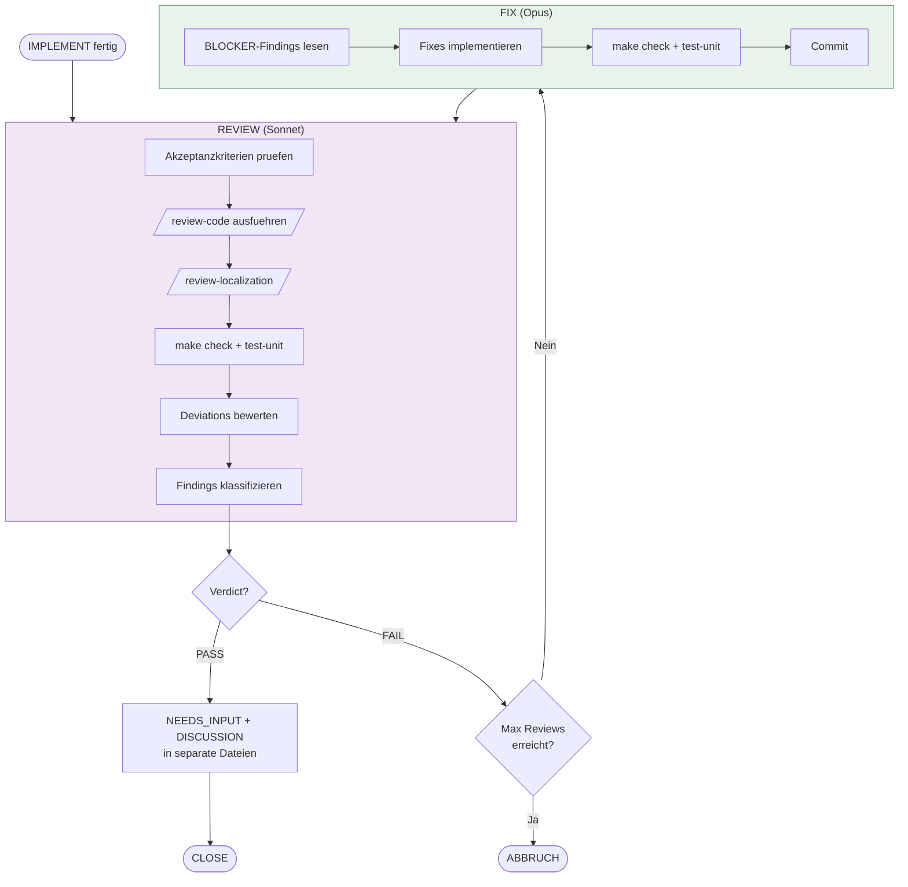

#### Die drei Finding-Kategorien

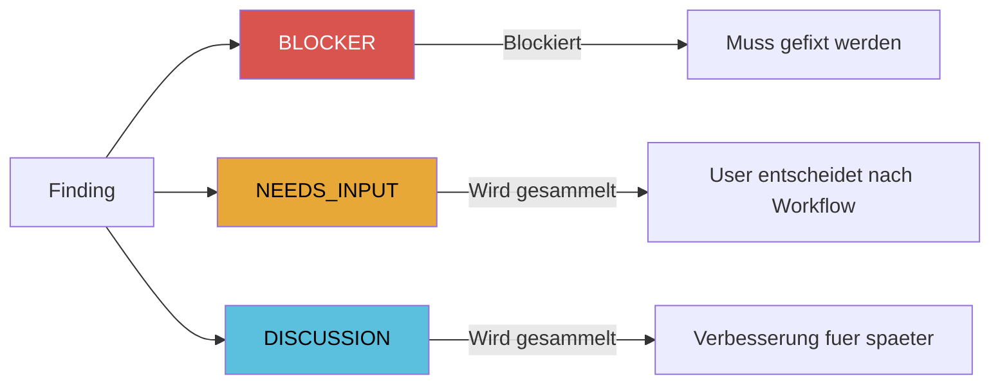

| Kategorie | Blockiert? | Beispiel |
|-----------|-----------|---------|
| BLOCKER | Ja, Verdict = FAIL | Fehlender Test, Security-Problem |
| NEEDS_INPUT | Nein, fuer User nach Workflow | Naming-Entscheidung ohne klare Antwort |
| DISCUSSION | Nein, Vorschlag fuer spaeter | Design-Alternative, Zukunfts-Idee |

### 3.4 CLOSE + LEARN

```mermaid
flowchart LR
    subgraph CLOSE ["CLOSE (Haiku)"]
        C1[/close-ticket/ Skill]
        C2[Status → DONE]
        C3[INDEX.md updaten]
        C4[Commit]
        C1 --> C2 --> C3 --> C4
    end

    subgraph LEARN ["LEARN (Sonnet, best-effort)"]
        L1[Challenges sammeln]
        L2{Generisch genug?}
        L2 -->|Ja| L3[MEMORY.md /<br/>CLAUDE.md updaten]
        L2 -->|Nein| L4[Verwerfen]
    end

    CLOSE --> LEARN

    style CLOSE fill:#d5e8d4,stroke:#82b366
    style LEARN fill:#dae8fc,stroke:#6c8ebf
```

---

## 4. Datenfluss: Das Implementation-Log

Alle Phasen kommunizieren ueber ein einziges append-only Log.

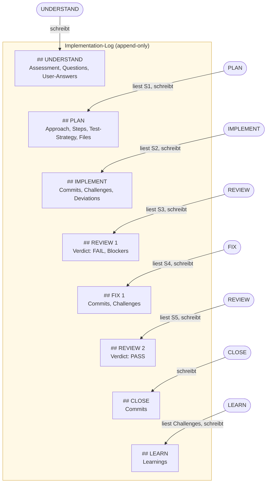

### Orchestrator-Aufgaben zwischen Phasen

Der Orchestrator ist nicht nur ein Agent-Starter — er extrahiert und transformiert Daten:

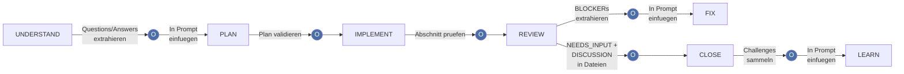

---

## 5. Agent-Architektur

Fuenf spezialisierte Agents statt einem Allzweck-Agent:

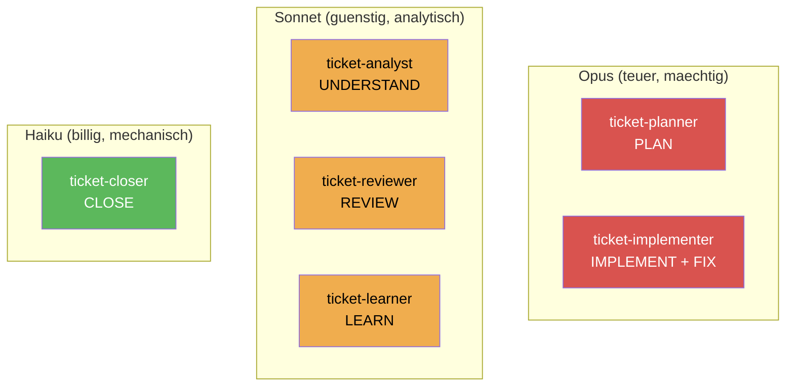

### Tool-Zugriff pro Agent

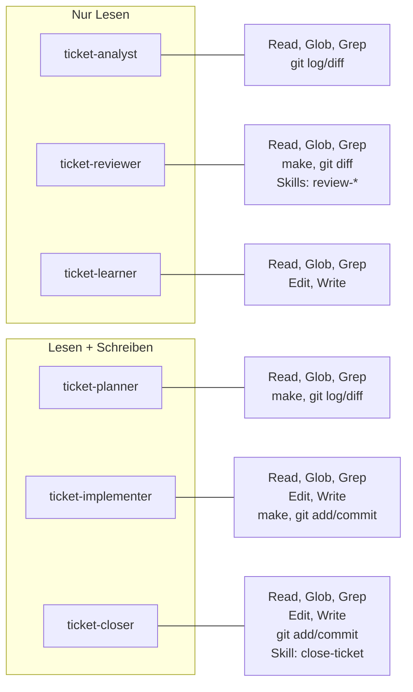

---

## 6. Interaktivitaets-Modell

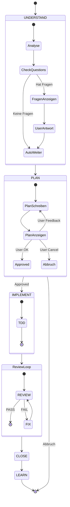

### Autonomer Modus (`--auto`)

Fuer CI/Batch-Laeufe: gleicher Workflow, ohne Warten.

| Phase | Interaktiv (Default) | Autonom (`--auto`) |
|-------|---------------------|-------------------|
| UNDERSTAND | Fragen → User antwortet | Fragen → **Abbruch** |
| PLAN | Plan → User approved | Plan → **auto-approved** |
| Rest | Identisch | Identisch |

---

## 7. Artefakte

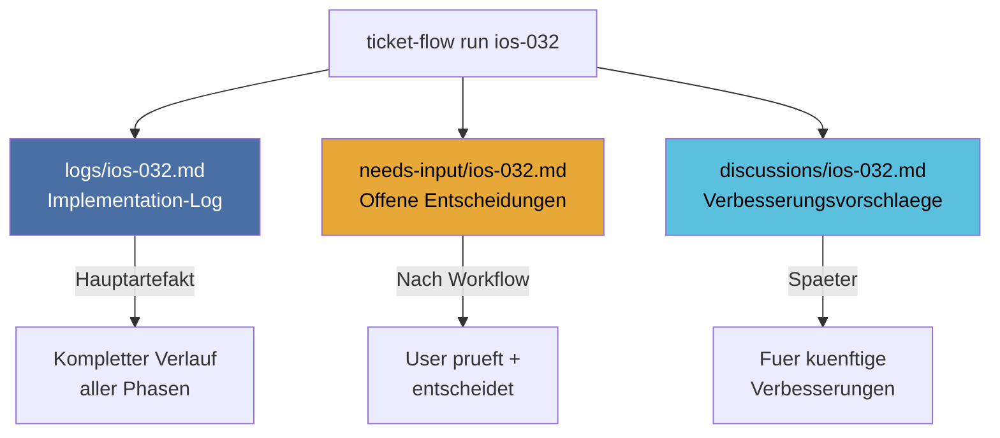

---

## 8. Vorher / Nachher

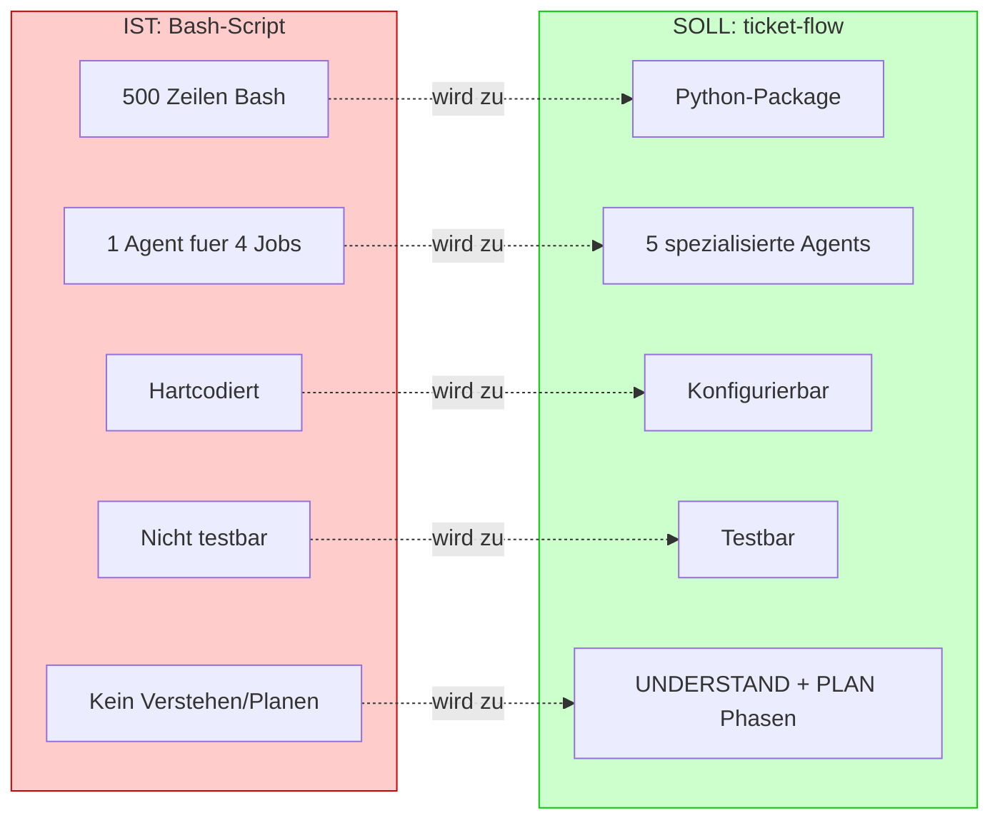
