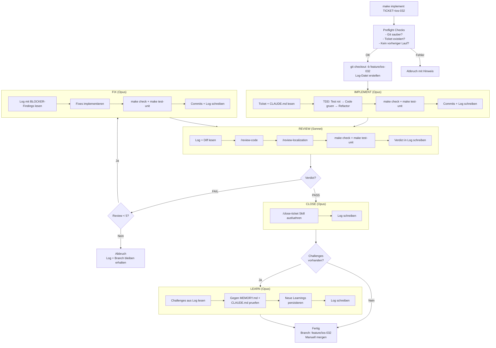

# Autonome Ticket-Implementation

Automatisierter Workflow: Ticket lesen, implementieren (TDD), reviewen, fixen, schliessen - ohne manuelle Interaktion.

## Schnellstart

```bash
make implement TICKET=ios-032

# Shared-Tickets brauchen --platform
make implement TICKET=shared-040 PLATFORM=ios
```

## Wie es funktioniert



Die Agents kommunizieren ueber eine shared Log-Datei (`dev-docs/tickets/logs/<ticket-id>.md`). Jeder Agent liest den bisherigen Verlauf und haengt seinen Abschnitt an. Das Script liest das Verdict strukturiert aus der Datei statt aus stdout - dadurch ist die PASS/FAIL-Erkennung robust unabhaengig vom Ausgabeformat des LLMs.

Der Implementer erfasst in jeder Phase (IMPLEMENT, FIX) aufgetretene Challenges zwischen `<!-- CHALLENGES_START -->` / `<!-- CHALLENGES_END -->`-Markern. Das Script sammelt diese am Ende und reicht sie an die LEARN-Phase weiter, die entscheidet ob sie als Learnings in MEMORY.md oder CLAUDE.md persistiert werden.

## Die zwei Agents

### ticket-implementer (Opus)

- Liest Ticket und CLAUDE.md
- Arbeitet im TDD-Workflow: Test rot → Code gruen → Refactor
- Lauft `make check` + `make test-unit` vor Commits
- Commit-Format: `feat(ios): #ios-032 Beschreibung`
- Kann auch Review-Findings fixen und Tickets schliessen
- **Darf nicht pushen**
- Erfasst Challenges (Stolpersteine, Workarounds) zwischen strukturierten Markern
- Persistiert Learnings in MEMORY.md oder CLAUDE.md (LEARN-Phase)

**Skills:**
| Phase | Skill | Zweck |
|-------|-------|-------|
| CLOSE | `/close-ticket` | Ticket-Status, INDEX.md, CHANGELOG.md |

### ticket-reviewer (Sonnet)

- Read-only: kann keinen Code aendern (nur Log-Datei via `tee -a`)
- Prueft gegen Ticket-Akzeptanzkriterien
- Lauft `make check` + `make test-unit`
- Schreibt Verdict (`PASS`/`FAIL`) in die Log-Datei
- BLOCKER fuehren zu FAIL, DISCUSSION-Punkte nicht
- DISCUSSION-Items werden in `dev-docs/tickets/discussions/<ticket-id>.md` gesammelt

**Skills:**
| Phase | Skill | Zweck |
|-------|-------|-------|
| REVIEW | `/review-code` | Wartbarkeit, Architektur, Lesbarkeit, Testabdeckung |
| REVIEW | `/review-localization` | Uebersetzungen, ungenutzte Keys, Cross-Platform-Konsistenz |

## Voraussetzungen

- Sauberer Git-Status (keine uncommitteten Aenderungen)
- Ticket existiert in `dev-docs/tickets/`
- `claude` CLI ist installiert und authentifiziert
- `bypassPermissions` ist fuer die Agents konfiguriert

## Sicherheit

| Massnahme | Beschreibung |
|-----------|-------------|
| Kein Push | Script pusht nie - manuelles Merge erforderlich |
| Feature Branch | main bleibt immer sauber |
| Read-only Reviewer | Kann keinen Code aendern (nur `tee -a` auf Log-Datei) |
| Max 5 Reviews | Abbruch nach 5 fehlgeschlagenen Reviews |
| Preflight | Uncommitted changes → sofortiger Abbruch |
| Branch/Log-Detection | Vorheriger Lauf (Branch oder Log) → sofortiger Abbruch mit Cleanup-Hinweis |
| Phase-aware Errors | `run_agent()` meldet Phase, Log-Pfad und Branch bei Agent-Fehlern |
| LEARN nicht blockierend | Fehlende Challenges oder LEARN-Fehler → Warning statt Abbruch |

## Discussion-Items

Der Reviewer klassifiziert Findings als BLOCKER oder DISCUSSION. BLOCKER muessen gefixt werden (fuehren zu FAIL). DISCUSSION-Items sind Anregungen, die nicht blockieren aber spaeter besprochen werden sollten.

Der Reviewer schreibt DISCUSSION-Items zwischen Marker:

```
DISCUSSION:
<!-- DISCUSSION_START -->
- datei:zeile - Verbesserungsvorschlag
<!-- DISCUSSION_END -->
```

Das Script extrahiert diese Items aus jeder Review-Runde und sammelt sie in:

```
dev-docs/tickets/discussions/<ticket-id>.md
```

Diese Datei wird **nicht automatisch committed** - sie liegt nach dem Lauf im Working Directory. So kannst du sie in Ruhe durchgehen und entscheiden, was davon umgesetzt wird.

Typische DISCUSSION-Items:
- Design-Alternativen
- Naming-Verbesserungen
- Zukunfts-Verbesserungen
- Architektur-Ueberlegungen ohne akute Dringlichkeit

## Ablauf nach Abschluss

Das Script erstellt alle Commits auf `feature/<ticket-id>`. Danach manuell:

```bash
# Commits pruefen
git log feature/ios-032 --oneline

# Diff gegen main anschauen
git diff main...feature/ios-032

# Mergen wenn zufrieden
git checkout main
git merge feature/ios-032
git branch -d feature/ios-032
```

## Fehlschlag

Bei Abbruch nach 5 Reviews oder Agent-Fehler enthaelt die Log-Datei den vollstaendigen Verlauf:

```
dev-docs/tickets/logs/<ticket-id>.md
```

Der Feature-Branch bleibt erhalten. Optionen:
1. Manuell fixen und erneut starten
2. Komplett neu starten: `git branch -D feature/<ticket-id> && rm dev-docs/tickets/logs/<ticket-id>.md`

## Dateien

| Datei | Zweck |
|-------|-------|
| `scripts/implement-ticket.sh` | Orchestrator-Script |
| `.claude/agents/ticket-implementer.md` | Implementer-Agent (Opus) |
| `.claude/agents/ticket-reviewer.md` | Reviewer-Agent (Sonnet) |
| `dev-docs/tickets/logs/<id>.md` | Implementation-Log (Kommunikationskanal zwischen Agents, wird persistiert) |
| `dev-docs/tickets/discussions/<id>.md` | Gesammelte Discussion-Items (pro Ticket) |
| `~/.claude/projects/.../memory/MEMORY.md` | Persistierte Learnings (projektspezifisch) |
